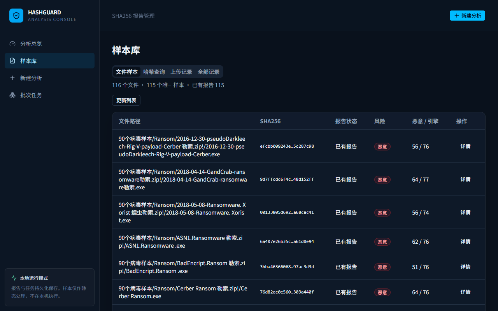
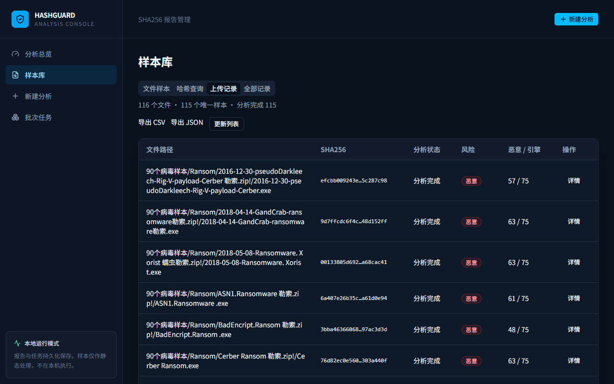

# VTBatchScanner

基于 VirusTotal API 的批量检测与报告管理工具。输入 SHA-256 或在本地计算文件哈希，即可查询已有检测报告，查看各引擎结果，自动生成 Markdown 检测报告，并导出 CSV / JSON / XLSX 或便携报告包。任务、缓存和请求预算保存在本地，支持中断后继续处理。

Python 程序负责批量查询和显式文件上传；React 网页提供输入预览、任务进度、报告明细和结果导出。默认使用 VirusTotal，旧国家平台兼容模块保留但不启用。

## 目录

- [快速开始](#快速开始)
- [配置说明](#配置说明)
- [网页使用](#网页使用)
- [查询、刷新与文件上传](#查询刷新与文件上传)
- [如何理解检测结果](#如何理解检测结果)
- [命令行批量处理](#命令行批量处理)
- [缓存、配额与断点续跑](#缓存配额与断点续跑)
- [结果文件与备份](#结果文件与备份)
- [单样本报告与汇总表](#单样本报告与汇总表)
- [离线测试](#离线测试)
- [常见问题](#常见问题)
- [项目结构](#项目结构)

## 快速开始

以下命令使用 Windows PowerShell。需要 Git、Python 3.12+、Node.js 和 npm；前端当前锁定的 Vite 要求 Node.js `20.19+`（20.x）或 `22.12+`，本项目已在 Node.js 24.19.0 下验证。

### 1. 获取项目并安装后端依赖

```powershell
git clone https://github.com/Skylar-Jiang/VTBatchScanner.git
cd VTBatchScanner
python -m venv .venv
.\.venv\Scripts\Activate.ps1
python -m pip install -r backend/requirements.txt
Copy-Item .env.example .env.local
```

复制配置模板只需执行一次，不要覆盖已有 `.env.local`。如果 PowerShell 阻止激活脚本，可直接使用虚拟环境的 Python：

```powershell
.\.venv\Scripts\python.exe -m pip install -r backend/requirements.txt
```

### 2. 配置 VirusTotal

编辑项目根目录的 `.env.local`，填写自己的 Key，并根据账户剩余额度设置本地预算：

```dotenv
VIRUSTOTAL_API_KEY=在本地填写密钥
VIRUSTOTAL_DAILY_BUDGET=500
VIRUSTOTAL_REQUEST_INTERVAL=16
```

API Key 从 [VirusTotal 账户页面](https://www.virustotal.com/gui/my-apikey) 获取。密钥只保存在后端配置中，不要填入前端、截图或提交到 Git。

官方公共 API 文档列出的限制为每日 500 次、每分钟 4 次；实际权限与额度以账户为准，使用范围也应遵守 [公共 / Premium API 条款](https://docs.virustotal.com/reference/public-vs-premium-api)。本地预算不能替代账户配额检查。

### 3. 启动后端

在项目根目录打开第一个终端：

```powershell
cd backend
..\.venv\Scripts\python.exe start_backend.py
```

启动脚本会加载根目录的 `.env.local`，并在 `127.0.0.1:8000` 启动后端。

### 4. 启动前端

在项目根目录打开第二个终端：

```powershell
cd frontend
npm ci
npm run dev -- --host 127.0.0.1 --port 5173 --strictPort
```

打开 [http://127.0.0.1:5173](http://127.0.0.1:5173)。后端交互式接口文档位于 [http://127.0.0.1:8000/docs](http://127.0.0.1:8000/docs)。两个终端保持运行；停止服务时按 `Ctrl+C`。

首次启动没有历史任务。先在“新建分析”导入哈希，创建批次，再到“批次任务”或“样本库 → 全部记录”查看结果。仓库中的示例汇总不会自动导入数据库。

## 配置说明

### 后端配置

配置写入根目录 `.env.local`，也可通过同名系统环境变量注入。系统环境变量优先，修改后需重启后端。

| 变量 | 默认值 | 用途 |
|---|---|---|
| `VIRUSTOTAL_API_KEY` | 空 | VirusTotal API Key；未配置时任务保留等待，不发送外部请求 |
| `VIRUSTOTAL_DAILY_BUDGET` | `500` | 本地每日请求预算；应设置为账户当日可用量以内的正整数 |
| `VIRUSTOTAL_REQUEST_INTERVAL` | `16` | 哈希查询的请求间隔，单位为秒；低于 16 的值仍按 16 秒处理 |

预算按 UTC 日期计数，保存在 SQLite 中，重启服务不会清零。网页显示的是本程序的预算使用量，不包含同一 Key 在其他工具中的消耗。

当前代码固定使用 7 天成功报告缓存、20 秒请求超时、单次查询操作最多 2 次请求尝试。模板中的 `CACHE_TTL_HOURS`、`PROVIDER_TIMEOUT_SECONDS` 等兼容字段尚未接入这些设置，修改它们不会改变当前行为。`CN_PLATFORM_*` 字段无需配置。

如果已设置系统环境变量，即使值为空，也会优先于 `.env.local`。需要恢复文件配置时，在启动服务的 PowerShell 中移除相应变量：

```powershell
Remove-Item Env:VIRUSTOTAL_API_KEY -ErrorAction SilentlyContinue
```

### 前端配置

前端默认连接 `http://127.0.0.1:8000/api/v1`，正常本机使用无需配置。调整后端地址时，在 `frontend/.env.local` 中设置：

```dotenv
VITE_API_BASE_URL=http://127.0.0.1:8000/api/v1
```

修改后重启 Vite。不要在 `VITE_` 变量中放 API Key，它们会进入浏览器构建产物。后端目前只允许 `localhost:5173` 和 `127.0.0.1:5173` 的跨域访问，换用其他前端端口还需同步修改 CORS 配置。

服务定位为本机工具，目前没有用户登录和访问控制，不应直接暴露到公网。`npm run build` 只生成前端静态文件，不会启动后端或完成部署。

## 网页使用

### 导入与创建任务

1. 打开“新建分析”，填写批次名称。
2. 粘贴 SHA-256，或导入 TXT / CSV。也可选择文件，仅在浏览器内计算哈希。
3. 检查有效、重复和无效项；“服务端预览”只校验输入，不请求 VirusTotal。
4. 点击“创建批次”，后台开始查询；在“批次任务”查看进度与失败数量。
5. 从“样本库 → 全部记录”打开报告明细，查看检测统计、厂商标签和分析时间。

SHA-256 必须是 64 位十六进制字符串，提交时统一转为小写并去重。单批最多 1000 个有效哈希，TXT / CSV 最大 64 KiB。浏览器本地文件哈希计算上限为 64 MiB；这里的文件选择不会上传样本。

TXT 每行一个哈希。CSV 必须包含 `sha256` 列，例如：

```csv
filename,sha256
Cerber.exe,efcbb009243e2f590351c1bdd6456e140d2711439906674d8d57a17f5c287c98
```

该行取自已保存的示例记录，导入后创建任务仍可能消耗真实配额。仅检查输入格式时停留在预览步骤。

### 进度与导出

“续跑”处理等待或中断的任务，不重复请求已结束项。CSV / JSON 导出读取本地结果，不调用 VirusTotal；未完成任务也可导出进度快照。100% 表示所有任务已进入终态，仍需查看成功、未收录和失败数量。

XLSX 和报告包同样只读取本地结果；报告包包含该批次的汇总及单样本 Markdown，可整体解压后离线查看。

样本库中“文件样本”“哈希查询”“上传记录”对应命令行 A/B 分组的保存记录，依赖本地输入清单与实验结果；普通网页创建的任务在“全部记录”中查看。

### 页面示例

文件历史报告：



独立保存的文件上传分析：



## 查询、刷新与文件上传

| 操作 | 实际行为 | 是否上传文件 | 配额消耗 |
|---|---|---|---|
| 普通查询 / 续跑 | 优先复用有效缓存，否则 `GET /files/{sha256}` 读取已有报告 | 否 | 缓存命中为 0；外部请求与重试均计数 |
| 刷新 / 重新查询 | 绕过缓存，再次读取平台当前已有报告，执行前确认额外消耗 | 否 | 会新增查询请求 |
| 文件上传分析 | 显式运行上传脚本，`POST /files` 提交字节，再 `GET /analyses/{id}` 取结果 | 是 | 提交和结果查询分别计数 |
| 重新分析 | 当前网页保留独立入口，后端返回 `reanalysis_not_supported`，尚未启用执行能力 | 否 | 当前不发送重新分析请求 |

真实文件可先计算 SHA-256 查询已有报告，未收录时再决定是否提交文件。只有哈希则只能匹配报告库，无法代替原始文件上传。刷新不会触发新的扫描，批量查询也不会自动上传或重新分析。

文件上传通过命令行显式授权，详见下一节。标准上传会让样本进入 VirusTotal 数据集并对社区可见，不应提交机密或个人敏感文件。[官方上传说明](https://docs.virustotal.com/reference/files-scan)

## 如何理解检测结果

VirusTotal 返回多家引擎的结果。本项目按以下规则生成汇总标签，不采用多数投票：

| 标签 | 判断条件 |
|---|---|
| 恶意 `malicious` | 至少一个引擎归类为 `malicious` |
| 可疑 `suspicious` | 没有恶意命中，但至少一个引擎归类为 `suspicious` |
| 未检出 `undetected` | 恶意和可疑均为 0，且存在 `undetected` 或 `harmless` 结果 |
| 未知 `unknown` | 报告不足以满足以上规则，例如全部引擎失败或不支持 |

例如 10 个引擎报恶意、70 个未检出，平台标签仍为“恶意”，同时保留 `10 / 80` 的引擎统计。这个比例不是文件含病毒的概率；单引擎命中也可能误报，应结合厂商明细和文件背景分析。

请求状态与风险标签分开记录：`not_found` 表示未收录，`authentication_error` 表示认证 / 权限失败，`rate_limited` 表示配额或速率限制，`timeout` / `failed` 表示请求失败。未检出、未收录和请求失败都不等于安全。

报告的 `analysisTime` 是平台原有分析时间，`queriedAt` 是本次查询时间。刚刚查询到的报告不一定刚刚完成分析。

## 命令行批量处理

以下脚本保留 A/B 两组工作流：A 为真实文件，B 为 TXT 哈希清单。任意单组哈希查询可直接使用网页导入。

恶意样本只在虚拟机等隔离环境中处理，并提前保存快照。清点程序在内存中读取 ZIP 成员，不落盘解压、不执行文件；公开仓库不提供样本包。

### 1. 清点输入

先在项目根目录打开终端，再执行：

```powershell
cd backend
..\.venv\Scripts\python.exe inventory_inputs.py --archive 'D:\isolated\samples.zip' --hashes 'D:\isolated\hashes.txt' --output ../results/experiment-3
```

路径替换为实际输入。脚本递归读取嵌套 ZIP，当前密码固定为 `virus`；读取失败会写入 `input-inventory.json`。密码错误、加密方式不支持或文件损坏不能通过运行 EXE 解决。

生成 `input-inventory.json`、`group-a-candidate-sha256.txt` 和 `group-b-sha256.txt`。该命令会覆盖同名输入清单，不要对正在运行或已完成的任务重新清点。

### 2. 查询与导出

以下命令均在 `backend` 目录执行：

```powershell
# 小规模真实验证：最多处理 2 个等待任务，重试可能增加请求数
..\.venv\Scripts\python.exe run_experiment.py --max-jobs 2

# 检查结果与剩余配额后，再处理其余等待项
..\.venv\Scripts\python.exe run_experiment.py --all

# 仅导出本地结果，不请求 VirusTotal
..\.venv\Scripts\python.exe run_experiment.py --export-only

# 根据已保存的清单和结果生成简洁 Markdown 报告
..\.venv\Scripts\python.exe generate_report.py
```

查询脚本默认只处理最多 3 个等待任务；`--all` 才处理整个队列。再次运行会复用 `batch-ids.json` 续跑。若保存的批次 ID 在数据库中不存在，脚本会停止，避免覆盖已有结果。

`--export-only` 首次运行仍会从现有哈希清单创建本地批次，但不会发送外部请求。报告生成需要自己的 `input-inventory.json` 和 A/B 结果，不是把公开示例 CSV 直接转换成报告。

### 3. 可选文件上传

上传脚本针对 A 组清单执行，**不是仅对未收录项自动筛选上传**。如只需分析未收录文件，应使用单独准备的相应文件清单，而不要直接运行全量上传。

```powershell
# 默认只提交 1 个待处理的唯一文件；参数表示同意向 VirusTotal 提交文件
..\.venv\Scripts\python.exe run_file_uploads.py --archive 'D:\isolated\samples.zip' --acknowledge-upload

# 完成小规模验证并确认提交范围与配额后，提交其余文件
..\.venv\Scripts\python.exe run_file_uploads.py --archive 'D:\isolated\samples.zip' --acknowledge-upload --all

# 只获取已提交分析的结果，不提交新文件
..\.venv\Scripts\python.exe run_file_uploads.py --archive 'D:\isolated\samples.zip' --acknowledge-upload --poll-only
```

脚本保存分析 ID 和下次查询时间，不会一直等待结果。首次结果查询至少等待 120 秒，后续至少间隔 300 秒，再运行 `--poll-only` 获取结果。每个文件最多自动提交 1 次、查询结果 3 次，上传流程请求间隔固定为至少 16 秒。

当前上传脚本仅支持不超过 32 MiB 的 ZIP 成员，没有接入大文件上传接口。提交结果不明确时记录 `submission_unknown` 并停止自动重传，应先核查已保存状态。

## 缓存、配额与断点续跑

- 成功查询按 SHA-256 持久化缓存 7 天，同一哈希的新任务可复用；失败和未收录结果不作为成功缓存。
- 每次外部请求尝试都扣减本地预算，失败重试也计数。哈希查询每次操作最多尝试 2 次，没有无限重试。
- 429 优先遵循 `Retry-After`，未提供时使用退避；较长冷却会保存并暂停后续任务。401 / 403 也会停止继续查询。
- 本地预算不足时，未完成任务保留为等待状态。核查账户额度和冷却时间后，手动续跑。
- 续跑只处理等待 / 中断项，已标记失败或未收录的终态项不会自动重新请求；确需重查时使用刷新并确认配额。
- 命令行批量处理和网页提交不要同时运行。当前使用单进程调度，不支持多个工作进程共享配额并发查询；命令行运行期间网页仅用于查看和导出。

服务重启不会自动恢复整个等待队列，需要手动点击“续跑”或再次运行命令行。不要通过删除数据库清零预算，这会同时丢失任务、缓存和计数。

## 结果文件与备份

| 位置 | 内容 |
|---|---|
| `backend/data/analysis.db` | 任务、查询结果、缓存、请求预算和冷却状态 |
| `data/reports/virustotal/` | 保存的文件查询原始报告 |
| `results/experiment-3/input-inventory.json` | 文件映射、哈希清点和读取错误 |
| `results/experiment-3/batch-ids.json` | A/B 批次 ID，用于续跑 |
| `results/experiment-3/group-a-results.csv/json` | A 组已有报告查询结果 |
| `results/experiment-3/group-b-results.csv/json` | B 组哈希查询结果 |
| `results/experiment-3/group-a-upload-results.csv/json` | 独立的文件上传状态、分析 ID 与结果 |
| `results/experiment-3/execution-summary.json` | A/B 查询进度汇总 |
| `results/experiment-3/实验报告.md` | 命令行生成的简洁报告 |
| `results/reports/files/` | 按原始文件名保存的单样本 Markdown 报告 |
| `results/reports/hashes/` | 按 SHA-256 保存的纯哈希报告 |
| `results/summary.csv` / `summary.xlsx` | 当前单样本报告索引，含报告及 VirusTotal 链接 |
| `results/detection-reports.zip` | 离线脚本生成的便携报告包，保持汇总表与报告相对路径 |

始终按上述步骤从 `backend` 目录启动后端，避免相对数据库路径创建另一份数据库。备份时先停止后端与批量程序，再一起复制数据库、`data/reports/` 和本地结果目录；恢复时保持对应关系。

仓库附带两份 SHA-256 清单、[分来源汇总 CSV](results/experiment-3/all_results_summary.csv) 和 [历史 / 上传结果对比](results/experiment-3/history_analysis_comparison.csv)。汇总共有 330 条报告记录，涉及 215 个唯一哈希；`method` 区分 `history_query`、`upload_analysis` 和 `hash_query`。这些是历史示例，不代表当前查询结果。CSV 中的 `detail_file` 指向原始实验交付中的明细，完整明细未包含在公开仓库。

密钥、运行数据库、原始报告、样本、完整个人实验报告和构建缓存不提交到 Git；公开示例文件通过 `.gitignore` 白名单保留。

## 单样本报告与汇总表

查询结果持久化后自动生成固定模板报告；缓存命中、未收录和失败同样记录状态。显式文件上传程序在保存进度时生成文件报告。报告生成和导出不访问 VirusTotal，不消耗 API 配额，也不使用大语言模型。

文件报告保留输入文件的原始名称和扩展名，例如 `results/reports/files/sample.exe.md`；纯哈希报告为 `results/reports/hashes/<sha256>.md`，不会把平台的 `meaningful_name` 当成输入文件名。同名不同哈希附加 `__<sha256前8位>`，必要时使用完整哈希后缀；同名同哈希复用原有报告。报告文件名清除路径分隔符和系统保留字符，原始名称仍保留在报告内容中。

模板包含 Sample Information、VirusTotal Detection Summary、Threat Classification、Representative Engine Results、Analysis Summary 和 Source。威胁标签只采用响应实际提供的字段；缺失写为“未提供”。恶意引擎按固定优先顺序选取最多 8 个，不足时展示实际数量。分析时间与本地查询时间分开记录，均为 UTC；总引擎数也包括 `harmless`、超时和失败等分类，不一定等于表中四项数量之和。

`summary.csv` / `summary.xlsx` 的字段包括 `group`、`filename`、`sha256`、`query_status`、`malicious`、`suspicious`、`undetected`、`unsupported`、`total_engines`、`threat_label`、`analysis_time`、`report`、`virustotal`、`source` 和 `queried_at`。失败或未收录的检测数量留空，不写成零。XLSX 的“查看检测报告”和“查看 VirusTotal 原始报告”是原生超链接，数值和时间保持对应数据类型。

网页的单样本详情和文件详情提供“查看检测报告”。批次支持 XLSX、报告包，文件样本页面可下载全局汇总。单独下载 XLSX 时，本地报告链接需要同目录下的 `reports/`；推荐下载报告包，**整体解压后再打开 `summary.xlsx`**，不要只移动工作簿。

已保存结果可在离线状态下重新生成报告，不改写实验报告正文：

```powershell
cd backend
..\.venv\Scripts\python.exe generate_detection_reports.py
```

默认读取 `results/experiment-3/`，可用 `--experiment`、`--results`、`--raw-reports` 指定目录。已有原始查询 JSON 的统计和分析时间与已保存报告一致时，仅补回其威胁分类字段；不会把历史分类移入上传分析。没有原始 JSON 时不补造字段。

文件的主报告保留上传分析结果，旧哈希查询列在独立的 Historical SHA-256 Query 附节。批次 XLSX 保留该批次的历史查询数值，链接指向含历史附节的主报告；批次报告包内的 Markdown 则直接对应该批次查询，导出过程仅在内存中生成，不覆盖上传结果。查询、上传和离线生成仍须保持单个写入进程，网页查看与导出可以同时进行。

仓库示例包括 116 个文件报告和 100 个哈希报告，涉及 215 个唯一哈希，均来自已保存的检测结果，不是本次重新查询。文件输入的实际数量为 116，本项目纳入了全部可读取文件。

实现索引与可用于报告的代码节选见 [report-code-map.md](docs/report-code-map.md)；架构和完整请求链见 [architecture.md](docs/architecture.md)。

## 离线测试

自动化测试使用 Mock 和临时存储，不消耗真实 API 配额。以下命令从项目根目录执行：

```powershell
cd backend
$env:VIRUSTOTAL_API_KEY=''
$env:CN_PLATFORM_API_KEY=''
..\.venv\Scripts\python.exe -m pytest -q
cd ../frontend
npm test
npm run build
```

已有测试覆盖正常响应、无效哈希、404、401 / 403、429、超时、网络异常、缓存、限速、续跑、上传状态、Markdown、CSV/XLSX 超链接及报告包导出。最终验证记录见 [verification-public.md](docs/verification-public.md)。

测试命令将当前终端的 Key 变量设为空。测试后启动真实查询前，移除这两个变量或使用新终端，避免它们遮蔽 `.env.local`。

## 常见问题

| 现象 | 检查方法 |
|---|---|
| `Activate.ps1` 被阻止 | 直接运行 `.venv\Scripts\python.exe`，无需修改系统执行策略 |
| `ModuleNotFoundError` | 使用同一虚拟环境安装并运行：`.venv\Scripts\python.exe -m pip install -r backend/requirements.txt` |
| 网页打不开 | 确认前端终端正在运行，访问 `127.0.0.1:5173`；仅启动后端不会提供网页 |
| 提示无法连接本地 API | 先打开 `127.0.0.1:8000/docs` 检查后端，再核对前端 API 地址和 CORS 端口 |
| 5173 / 8000 端口被占用 | 查找并停止自己的旧服务；前端使用 `--strictPort`，不会悄悄切换端口 |
| Node.js 版本不支持、依赖安装异常 | 执行 `node --version` / `npm --version`；使用支持的 Node.js，在 `frontend` 中运行 `npm ci`，保留锁文件 |
| Key 已填写但任务一直等待 | 检查是否存在空的系统环境变量，并确认通过 `start_backend.py` 启动、修改后已重启 |
| 401 / 403 | 核查 Key 是否有效及账户是否具有该接口权限；不要反复刷新重试 |
| 429 | 按冷却时间等待并核查账户额度；本地预算可能未包含其他工具的消耗 |
| 404 / 未收录 | 平台没有对应的已有报告；只有哈希时无法上传原始样本 |
| 本地预算耗尽 | 保存进度，核查账户当日余量及 UTC 日期后续跑，不要删库或盲目调大预算 |
| 文件分组提示 `experiment_inputs_missing` | 尚未生成 A/B 输入清单；普通网页任务使用“样本库 → 全部记录”查看 |
| `reanalysis_not_supported` | 当前版本未启用重新分析；刷新只是重新读取已有报告 |
| 上传停留在 `accepted` / `queued` | 检查保存的 `nextPollAt`，到时运行 `--poll-only`；成功前不要重复提交 |
| 嵌套 ZIP 读取失败 | 查看输入清单中的路径与错误；当前只使用密码 `virus`，不尝试运行文件或猜测密码 |
| `report_write_failed` / 报告未能写入 | 查询或上传结果仍已保存；关闭占用的文件并检查目录权限，运行 `generate_detection_reports.py` 离线补建，不要因此重复查询 |
| XLSX 本地报告链接打不开 | 完整解压报告包，保持 `summary.xlsx` 与 `reports/` 相对位置；只有单独的 XLSX 文件无法包含 Markdown 文件 |

## 项目结构

```text
VTBatchScanner/
├── backend/
│   ├── app/
│   │   ├── api/                 # 本地 FastAPI 路由
│   │   ├── providers/           # VirusTotal 响应与上传适配
│   │   └── services/            # 校验、任务、缓存、限速与存储
│   ├── tests/                   # 离线测试
│   ├── start_backend.py         # 加载本地配置并启动后端
│   ├── inventory_inputs.py      # ZIP 静态清点和哈希提取
│   ├── run_experiment.py        # A/B 查询、续跑、导出
│   ├── run_file_uploads.py      # 显式文件上传与有限轮询
│   ├── generate_report.py       # 原有简洁实验报告生成器
│   └── generate_detection_reports.py # 离线补建单样本报告与便携包
├── frontend/                    # React / TypeScript / Vite / shadcn/ui
├── docs/screenshots/            # 页面示例
├── results/                     # Markdown 报告、索引及公开历史示例
├── .env.example                 # 空密钥配置模板
└── README.md
```

官方接口：[文件报告查询](https://docs.virustotal.com/reference/file-info)、[文件对象字段](https://docs.virustotal.com/reference/files)、[上传文件](https://docs.virustotal.com/reference/files-scan)、[读取分析结果](https://docs.virustotal.com/reference/analysis)。
