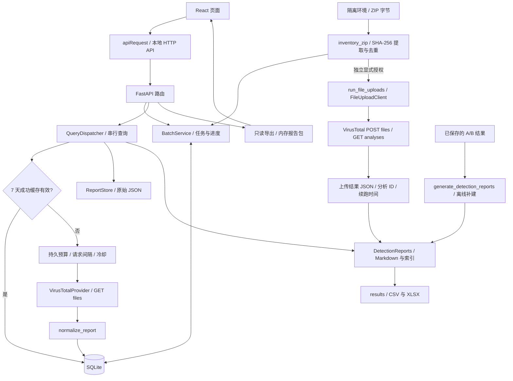
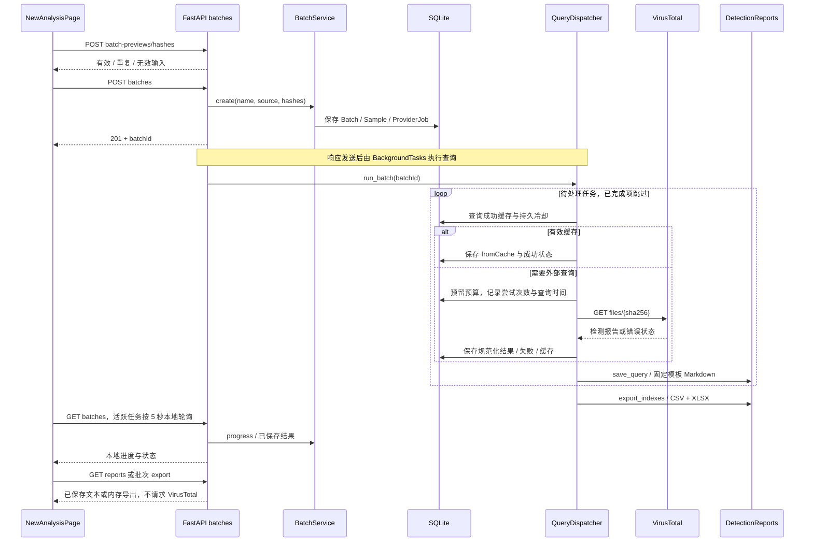

# 系统架构

系统由 React 前端、FastAPI 后端和 SQLite 数据库组成，使用单进程在本机运行。前端通过 HTTP API 创建任务、读取进度和导出结果。SQLite 保存任务、缓存、配额及查询记录，文件系统保存原始 JSON、单样本 Markdown 和汇总表。

## 模块关系

哈希查询读取 VirusTotal 已有报告；文件上传提交样本字节，并通过分析 ID 获取结果。网页选择文件时只计算哈希，上传由带有 `--acknowledge-upload` 参数的命令行执行。刷新绕过缓存重新查询已有报告。重新分析是独立操作，当前入口返回 `409 reanalysis_not_supported`。

## 创建批次的请求时序

## 数据与配置

- `QueryRecord` 保存每个查询任务的尝试数、缓存标记、查询时间、错误和规范化报告；`VirusTotalCache` 以 SHA-256 为键。
- `ProviderDailyQuota` 按提供方和 UTC 日期累计请求数，`ProviderCooldown` 保存 429 冷却时间。查询、上传和报告生成使用单个写入进程。
- 单样本报告以文件名 + SHA-256 标识或纯 SHA-256 标识复用。文件主报告保留上传分析，历史查询写在附节；批次报告包用该批次的数据在内存中生成。
- 全局报告包根据同一份索引数据生成汇总表和 Markdown；网页导出在内存中完成。
- 查询或上传结果先保存，再生成报告。报告写入错误独立显示，已保存的结果可用于离线补建。
- Key 由后端环境变量提供，不传给前端。服务默认绑定回环地址，没有登录功能，不直接面向公网部署。

安装、配置与操作步骤见 [README](../README.md)。
